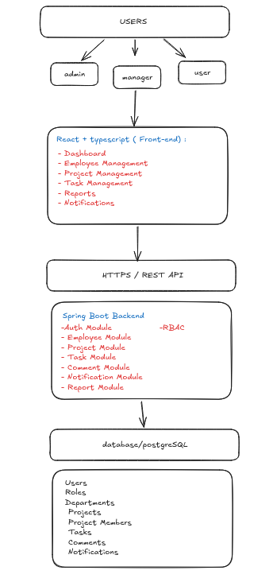

<!-- HERO BANNER -->

<div align="center">


# 🚀 Employee Task Tracker

### Enterprise Employee & Project Management Platform

<p align="center">
  
</p>

<p align="center">
  
  
  
  
  
  
</p>

<p align="center">
  <strong>Manage Employees • Track Projects • Assign Tasks • Monitor Productivity</strong>
</p>

</div>

---

## 🎥 Product Walkthrough

<p align="center">
  
</p>

---

## 🎯 Overview

Employee Task Tracker is a full-stack enterprise application designed to streamline employee management, project tracking, and task collaboration.

### Key Highlights

✅ Employee Management

✅ Project Management

✅ Task Assignment & Tracking

✅ Team Collaboration

✅ Analytics Dashboard

✅ Role-Based Access Control

✅ JWT Authentication

---

## 🏛️ Architecture

<p align="center">
  
</p>

---

## 🛠️ Tech Stack

| Frontend       | Backend         | Database   |
| -------------- | --------------- | ---------- |
| React          | Spring Boot     | PostgreSQL |
| TypeScript     | Spring Security |            |
| Tailwind CSS   | JWT             |            |
| ShadCN UI      | Hibernate       |            |
| TanStack Query | Maven           |            |

---

## 📸 Application Screens

<p align="center">
  
  
</p>

<p align="center">
  
  
</p>

---

## 🗄️ Database Design

<p align="center">
  
</p>

---

## 🚀 Development Progress

* [x] Requirements Gathering
* [x] High Level Design
* [x] Database Design
* [ ] Authentication Module
* [ ] Employee Management
* [ ] Project Management
* [ ] Task Management
* [ ] Notifications
* [ ] Reports
* [ ] Redis Integration
* [ ] RabbitMQ Integration

---

## 📂 Project Structure

```bash
employee-task-tracker
│
├── frontend
├── backend
├── docs
│   ├── banner.png
│   ├── demo.gif
│   ├── hld.png
│   ├── er-diagram.png
│   ├── dashboard.png
│   ├── projects.png
│   ├── employees.png
│   └── tasks.png
│
└── README.md
```

---


## 🎯 Future Roadmap

* Kanban Board
* Time Tracking
* Leave Management
* Attendance Tracking
* AI Task Breakdown
* AI Productivity Reports
* Docker Deployment
* Kubernetes Deployment

---

## 👨‍💻 Author

### Siddhi Singh Rathor

Java • Spring Boot • React • Cloud Computing

---

<div align="center">

⭐ Star this repository if you found it useful.

🚀 Building software with real-world engineering practices.

</div>
